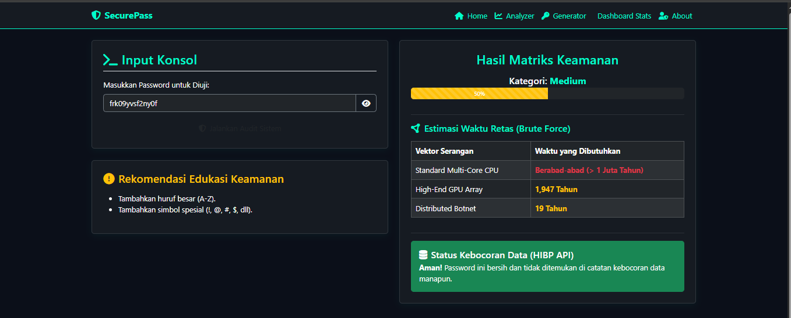
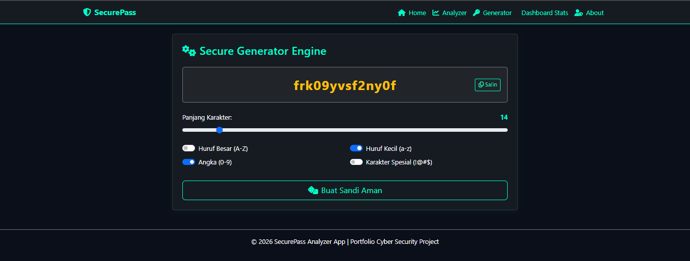
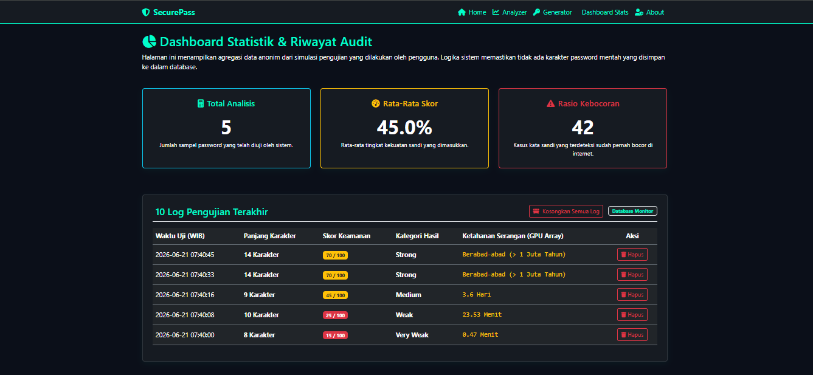

# SecurePass Analyzer 🛡️

Aplikasi web audit keamanan password canggih yang dirancang menggunakan Flask, Bootstrap 5, dan SQLite. Fokus utama proyek ini adalah menyediakan visualisasi ancaman brute-force dan validasi database kebocoran global Have I Been Pwned secara anonim dan aman (k-Anonymity).

## 🚀 Fitur Unggulan
- **Password Strength Analyzer:** Menilai kekuatan kata sandi secara lokal berdasarkan entropi, struktur, dan kamus pola buruk.
- **k-Anonymity Breach Checker:** Menghitung hash SHA-1 dan hanya mengirimkan 5 karakter pertama ke API luar demi proteksi privasi mutlak.
- **Brute Force Cost Estimator:** Estimasi kalkulasi waktu tebak sandi untuk infrastruktur komputasi CPU, GPU, dan Botnet.
- **Cryptographically Secure Generator:** Membuat password acak kuat berbasis modul `secrets` Python.

## 🖥️ Antarmuka Aplikasi (Application Screenshots)

Berikut adalah visualisasi antarmuka dan fitur utama dari SecurePass Analyzer:

---

### 1. Halaman Utama (Dashboard Home)
<p align="center">
  
</p>
<p align="center">
  <em>Gerbang utama aplikasi yang menyajikan ringkasan edukasi mengenai ancaman siber seperti Brute Force Attack serta penjelasan transparansi sistem privasi menggunakan metode <strong>k-Anonymity</strong>.</em>
</p>

---

### 2. Modul Audit Keamanan (Password Analyzer)
<p align="center">
  
</p>
<p align="center">
  <em>Fitur inti untuk menguji ketahanan kata sandi secara real-time. Sistem memberikan metrik tingkat kekuatan (skor %), estimasi waktu retas komputasi (CPU, GPU, Botnet), rekomendasi perbaikan enkripsi, serta validasi kebocoran database global via HIBP API secara anonim.</em>
</p>

---

### 3. Pembuat Sandi Kriptografis (Secure Generator Engine)
<p align="center">
  
</p>
<p align="center">
  <em>Mesin generator berbasis pustaka <code>secrets</code> (kriptografi aman) yang memungkinkan pengguna menciptakan kata sandi acak berkekuatan tinggi dengan kustomisasi panjang karakter, angka, huruf kapital, serta simbol spesial.</em>
</p>

---

### 4. Dasbor Statistik & Riwayat (Dashboard Stats & Audit Log)
<p align="center">
  
</p>
<p align="center">
  <em>Halaman pemantau data analitik yang menyajikan agregasi total audit, rata-rata skor keamanan, dan rasio deteksi kebocoran. Seluruh riwayat pengujian dicatat menggunakan format <strong>Waktu Indonesia Barat (WIB)</strong> dan dilengkapi fitur penghapusan log (kapabilitas CRUD).</em>
</p>

## 🛠️ Instalasi & Cara Menjalankan

1. Clone repositori ini:
   ```bash
   git clone https://github.com/Nigizagar/SecurePass-Analyzer.git
   cd SecurePass-Analyzer